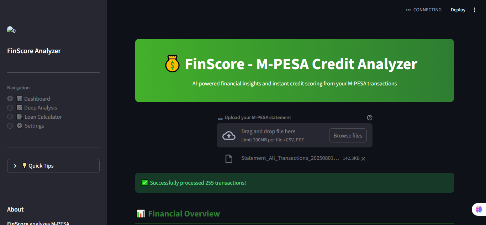

 FinScore - M-PESA Credit Scoring Engine

An AI-powered credit scoring system that analyzes M-PESA transactions to determine loan eligibility for the unbanked.



   My Contributions

 What I Built
Credit Scoring Engine (`credit_scorer.py`)
  - Custom algorithm that converts transaction patterns into credit scores (0-100)
  - Identifies risk factors: irregular income, night transactions, rounded amounts, low cash flow
  - Maps scores to real loan decisions with interest rates

Loan Eligibility System
  - Decision logic: APPROVE (KES 50k/8%), CONDITIONAL (KES 3k/20%), DECLINE
  - Transparent explanations for each decision

UI/UX Enhancements
  - Added "Get My Credit Score" button to the dashboard
  - Color-coded scores (green/yellow/red)
  - Risk factor breakdown in expandable sections
  - Professional metric cards and styling

Debugging & Integration
  - Fixed session state issues
  - Connected credit scorer to the main application
  - Ensured seamless data flow

How The Credit Score Works

The model analyzes 7 key features:

| Feature | What It Measures | Why It Matters |
|---------|------------------|----------------|
| Average Daily Balance | How much money you keep | Shows financial stability |
| Income Regularity | Consistency of deposits | Predicts ability to repay |
| Night Transaction Ratio | Late-night activity | Potential risk indicator |
| Airtime Ratio | Regular airtime purchases | Shows stable behavior |
| Rounded Amount Ratio | Transactions ending in 00 | Possible gambling |
| Low Balance Frequency | How often balance drops | Cash flow issues |
| Transaction Frequency | Account activity level | Engagement indicator |

 Tech Stack

Python 3.8- Core logic
Streamlit - Web interface
Pandas- Data processing
Plotly- Interactive visualizations
Markov Chains- Transaction prediction

 Project Structure
app.py # Main application (modified)
├── credit_scorer.py # MY CREDIT SCORING ENGINE
├── data_processor.py # Statement parser (original)
├── categorizer.py # Transaction categorizer (original)
├── markov_predictor.py # Next transaction predictor (original)
├── visualizer.py # Chart functions (original)
└── requirements.txt # Dependencies


  Sample Output

When a user uploads their statement, they get:
Credit Score: 25/100
Decision: ❌ DECLINE
Loan Offer: KES 0

Risk Factors Identified:
• Irregular income - risk factor
• Some rounded amounts
• Frequently low balance - cash flow issues


##  How to Run

1. Clone this repo
```bash
git clone https://github.com/evanscodes-tech/mpesa-insights.git
cd mpesa-insights

Install dependencies
pip install -r requirements.txt

Run the app
streamlit run app.py

Upload your M-PESA statement and get your credit score!

Real-World Impact
This project addresses a critical problem in Kenya: how to lend to the 80% of Kenyans who lack formal credit history. By using M-PESA transaction data as alternative data, this model helps:

Financial institutions assess risk for new customers

SACCOs make data-driven lending decisions

The unbanked access credit based on their actual behavior

🙏 Credits

This project builds upon the excellent M-Pesa Insights by Stanley Njoroge (mufasa78) , which provides:

M-PESA statement parsing

Transaction categorization

Financial health metrics

Markov Chain predictions

My contribution extends it with a complete credit scoring and loan eligibility system.

 License

MIT

 Contact
GitHub: @evanscodes-tech

Project Link: https://github.com/evanscodes-tech/mpesa-insights
